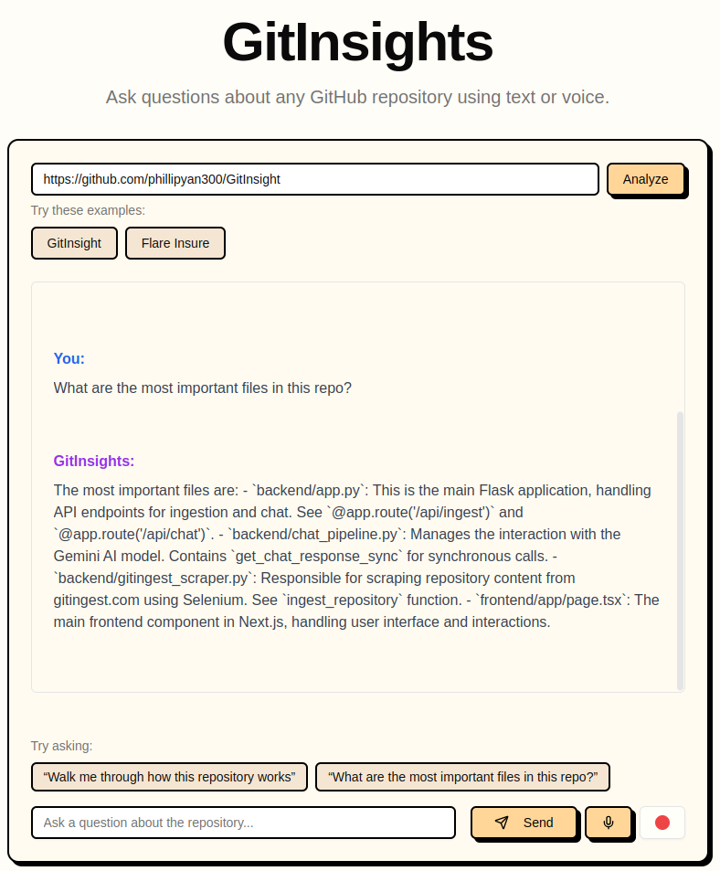

# GitInsights

AI-assited onboarding for understanding GitHub repositories. Ask questions about any codebase using text or voice with this conversational AI tool.



## Features
Demo video: https://www.loom.com/share/fa91acc50de6443da962f09761e02803?sid=4f6abb88-2520-42d6-846e-ba4a0b28e757  
- ��� Analyze any public GitHub repository
- 💬 Ask questions about the code in natural language  
- 🎙️ Voice interface for hands-free interaction
- 🤖 Powered by Google's Gemini AI

## Getting Started

### Prerequisites

- Node.js 18+
- Python 3.8+
- Chrome/Chromium browser
- Google API key

### Installation

1. Clone and install dependencies:

```bash
git clone https://github.com/yourusername/gitinsights.git
cd gitinsights
npm install
```

2. Set up environment variables:

Create `backend/.env`:
```bash
GOOGLE_API_KEY=your_google_api_key
```

3. Start the servers:

```bash
cd frontend
npm install
npm run dev
```

```bash
cd backend
pip install -r requirements.txt
python app.py
```
4. Open http://localhost:3000

## Usage

1. Enter a GitHub repository URL
2. Wait for analysis to complete
3. Ask questions about the codebase:
   - Type in the chat input
   - Or use voice with the microphone button
4. Get AI-powered explanations about the code


## License

MIT
